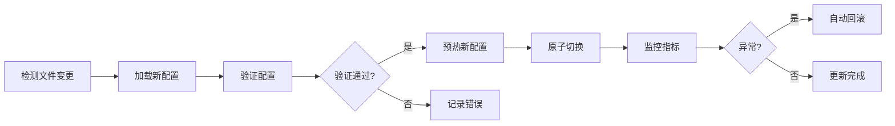

# C++ DMP-like 实时风控原型系统技术设计方案

## 1. 目标与 SLO

### 1.1 系统目标
构建一个单机版实时风控决策引擎原型，验证 C++ 技术栈在金融反欺诈场景的可行性，为后续生产级系统提供技术储备。

### 1.2 核心 SLO 指标

| 指标类型 | 目标值 | 测量方法 |
|---------|--------|---------|
| **P99 延迟** | ≤ 50ms | 端到端响应时间 |
| **P95 延迟** | ≤ 30ms | 端到端响应时间 |
| **P50 延迟** | ≤ 10ms | 端到端响应时间 |
| **吞吐量** | ≥ 10,000 TPS | 单机并发处理能力 |
| **可用性** | 99.9% | 服务正常运行时间 |
| **CPU 使用率** | < 80% | 峰值负载下 |
| **内存使用** | < 4GB | 稳定运行状态 |
| **规则更新延迟** | < 1s | 热更新生效时间 |

## 2. 组件清单

### 2.1 核心组件选型（按热路径顺序）

| 组件 | 开源项目 | 版本 | 选型理由 |
|-----|---------|------|---------|
| **HTTP 服务器** | Drogon | 1.9.x | C++17 原生协程，内置连接池，性能超越 Nginx |
| **JSON 解析** | simdjson | 3.x | SIMD 加速，GB/s 级解析速度，零拷贝设计 |
| **特征缓存** | parallel-hashmap | latest | Swiss table 实现，比 std::unordered_map 快 2-3 倍 |
| **规则引擎** | ExprTk | 0.0.2 | JIT 编译，数学表达式性能接近原生 C++ |
| **模式匹配** | Hyperscan | 5.4.x | Intel 正则引擎，支持批量并行匹配 |
| **ML 推理** | ONNX Runtime | 1.17.x | 跨平台优化，支持多种加速器 |
| **线程池** | BS::thread_pool | 4.x | 现代 C++17 设计，低开销任务调度 |
| **日志** | spdlog | 1.13.x | 异步日志，格式化性能优异 |
| **监控指标** | prometheus-cpp | 1.2.x | 原生 Prometheus 集成 |
| **配置管理** | toml++ | 3.x | 现代 C++17 TOML 解析器 |

### 2.2 选型对比分析

**为什么选择 Drogon 而非 Beast/Crow？**
- Drogon 基于 C++17 协程，避免回调地狱
- 内置连接池、Session、WebSocket 等完整功能
- 基准测试显示 QPS 超过 178,000（TechEmpower Round 21）

**为什么选择 simdjson 而非 RapidJSON？**
- SIMD 指令集优化，解析速度达 3GB/s
- 零拷贝设计，减少内存分配
- On-demand API 支持惰性解析，降低延迟

**为什么选择 ExprTk 而非 muparser？**
- JIT 编译优化，性能接近手写 C++
- 支持向量运算和复杂数学函数
- 线程安全，支持并发执行

## 3. 架构与线程模型

### 3.1 整体架构图

```
┌─────────────────────────────────────────────────────────────┐
│                     HTTP Request (JSON)                      │
└───────────────────────────┬─────────────────────────────────┘
                            ▼
┌─────────────────────────────────────────────────────────────┐
│                    Drogon HTTP Server                        │
│                  (Event Loop Thread Pool)                    │
└───────────────────────────┬─────────────────────────────────┘
                            ▼
┌─────────────────────────────────────────────────────────────┐
│                   Request Validator                          │
│                  (simdjson + Schema)                        │
└───────────────────────────┬─────────────────────────────────┘
                            ▼
┌─────────────────────────────────────────────────────────────┐
│                   Feature Extractor                          │
│              (Parallel HashMap + Redis)                      │
└───────────────────────────┬─────────────────────────────────┘
                            ▼
        ┌───────────────────┴───────────────────┐
        ▼                                       ▼
┌──────────────┐                    ┌───────────────────┐
│ Rule Engine  │                    │ Pattern Matcher   │
│  (ExprTk)    │                    │  (Hyperscan)     │
└──────┬───────┘                    └────────┬──────────┘
        └───────────────────┬───────────────────┘
                            ▼
┌─────────────────────────────────────────────────────────────┐
│                    ML Inference                              │
│                  (ONNX Runtime)                             │
└───────────────────────────┬─────────────────────────────────┘
                            ▼
┌─────────────────────────────────────────────────────────────┐
│                  Decision Fusion                             │
│               (Weighted Voting/Logic)                        │
└───────────────────────────┬─────────────────────────────────┘
                            ▼
┌─────────────────────────────────────────────────────────────┐
│                    Response Builder                          │
│                   (simdjson::writer)                        │
└─────────────────────────────────────────────────────────────┘
```

### 3.2 线程模型设计

```cpp
struct ThreadModel {
    // IO 线程池：处理网络 I/O
    size_t io_threads = 4;           // Drogon event loops
    
    // 工作线程池：CPU 密集型任务
    size_t worker_threads = 8;        // BS::thread_pool
    
    // 推理线程池：ML 模型推理专用
    size_t inference_threads = 2;     // ONNX Runtime sessions
    
    // 后台线程：热更新、监控
    size_t background_threads = 2;    // Update & metrics
};
```

### 3.3 并发模型

- **IO 多路复用**：Drogon 使用 epoll/kqueue 实现高效事件驱动
- **无锁队列**：使用 moodycamel::ConcurrentQueue 传递任务
- **线程局部存储**：规则引擎实例使用 thread_local 避免锁竞争
- **批处理优化**：Hyperscan 支持批量模式匹配，减少调用开销

## 4. 数据契约

### 4.1 请求格式

```json
{
  "request_id": "550e8400-e29b-41d4-a716-446655440000",
  "timestamp": 1703001234567,
  "transaction": {
    "amount": 1299.99,
    "currency": "USD",
    "merchant_id": "MERCH_12345",
    "merchant_category": "5411",
    "pos_entry_mode": "CHIP"
  },
  "card": {
    "token": "tok_4242424242424242",
    "issuer_country": "US",
    "card_brand": "VISA"
  },
  "device": {
    "ip": "192.168.1.1",
    "fingerprint": "df_abc123",
    "user_agent": "Mozilla/5.0..."
  },
  "customer": {
    "id": "cust_789",
    "risk_score": 35,
    "account_age_days": 365
  }
}
```

### 4.2 响应格式

```json
{
  "request_id": "550e8400-e29b-41d4-a716-446655440000",
  "decision": "APPROVE",  // APPROVE | DECLINE | REVIEW
  "risk_score": 15.5,
  "reasons": [
    {
      "code": "RULE_001",
      "description": "Transaction amount within normal range",
      "score_impact": -5.0
    }
  ],
  "latency_ms": 12.3,
  "model_version": "v2024.01.15",
  "timestamp": 1703001234579
}
```

### 4.3 内部数据结构

```cpp
struct Transaction {
    std::string request_id;
    uint64_t timestamp;
    
    struct {
        double amount;
        std::string currency;
        std::string merchant_id;
        uint16_t merchant_category;
        std::string pos_entry_mode;
    } transaction;
    
    struct {
        std::string token;
        std::string issuer_country;
        std::string card_brand;
    } card;
    
    // 特征向量（预计算）
    std::vector<float> features;
    
    // 决策结果
    enum Decision { APPROVE, DECLINE, REVIEW };
    Decision decision;
    float risk_score;
    std::vector<std::string> triggered_rules;
};
```

## 5. 规则与名单

### 5.1 规则引擎设计

**ExprTk 规则示例：**

```cpp
// 规则定义结构
struct Rule {
    std::string id;
    std::string expression;
    float weight;
    std::string description;
    bool enabled;
};

// 规则示例
Rule high_amount_rule {
    .id = "RULE_HIGH_AMOUNT",
    .expression = "amount > 10000 and merchant_risk > 0.7",
    .weight = 20.0,
    .description = "High amount transaction with risky merchant",
    .enabled = true
};
```

### 5.2 名单匹配设计

**Hyperscan 配置：**

```cpp
struct BlocklistConfig {
    // 编译模式
    unsigned int mode = HS_MODE_BLOCK;  // 块模式，适合批量匹配
    
    // 模式数据库
    struct Pattern {
        std::string regex;
        unsigned int flags;  // HS_FLAG_CASELESS | HS_FLAG_DOTALL
        unsigned int id;
    };
    
    std::vector<Pattern> patterns = {
        {"192\\.168\\.\\d+\\.\\d+", HS_FLAG_DOTALL, 1},  // 内网 IP
        {"TOR_EXIT_.*", HS_FLAG_CASELESS, 2},            // TOR 节点
        {"MERCH_FRAUD_.*", HS_FLAG_CASELESS, 3}          // 欺诈商户
    };
};
```

### 5.3 性能优化策略

- **预编译**：启动时编译所有规则和正则表达式
- **缓存友好**：规则按优先级排序，热规则优先评估
- **SIMD 加速**：Hyperscan 自动使用 AVX2/AVX512 指令集
- **批量处理**：多个字段合并后一次性匹配

## 6. 特征工程与缓存设计

### 6.1 多级缓存架构

```cpp
class FeatureCache {
private:
    // L1: 线程本地缓存（最热数据）
    thread_local phmap::flat_hash_map<std::string, Features> l1_cache;
    
    // L2: 进程级 LRU 缓存
    using LRUCache = tsl::robin_map<std::string, Features>;
    LRUCache l2_cache;
    std::shared_mutex l2_mutex;
    
    // L3: Redis 缓存（可选）
    std::unique_ptr<sw::redis::Redis> redis_client;
    
public:
    // 查询优先级：L1 -> L2 -> L3 -> 计算
    std::optional<Features> get(const std::string& key);
    void put(const std::string& key, const Features& features);
};
```

### 6.2 特征计算管线

| 特征类型 | 计算方法 | 缓存 TTL | 更新策略 |
|---------|---------|----------|---------|
| 静态特征 | 预计算 | 24h | 定时批量 |
| 聚合特征 | 滑动窗口 | 5min | 增量更新 |
| 实时特征 | 即时计算 | 不缓存 | - |
| 外部特征 | API 调用 | 1h | 异步刷新 |

### 6.3 特征向量结构

```cpp
struct Features {
    // 基础特征（32 维）
    std::array<float, 32> basic_features;
    
    // 时序特征（16 维）
    std::array<float, 16> temporal_features;
    
    // 聚合特征（16 维）
    std::array<float, 16> aggregated_features;
    
    // 元数据
    uint64_t computed_at;
    uint32_t version;
    
    // 序列化支持
    std::vector<float> to_vector() const;
};
```

## 7. 模型推理

### 7.1 ONNX Runtime 配置

```cpp
struct InferenceConfig {
    // 会话选项
    Ort::SessionOptions session_options;
    
    // 执行提供者
    enum Provider { CPU, CUDA, TensorRT, OpenVINO };
    Provider provider = CPU;
    
    // 优化级别
    GraphOptimizationLevel opt_level = ORT_ENABLE_ALL;
    
    // 线程配置
    int intra_threads = 2;  // 操作内并行
    int inter_threads = 1;  // 操作间并行
    
    // 内存模式
    bool use_arena = true;  // Arena 分配器
    size_t arena_extend_size = 256 * 1024 * 1024;  // 256MB
};
```

### 7.2 模型管理

```cpp
class ModelManager {
private:
    struct Model {
        std::string version;
        std::unique_ptr<Ort::Session> session;
        std::atomic<uint64_t> request_count;
        std::atomic<uint64_t> total_latency_us;
    };
    
    // 多版本支持
    std::map<std::string, Model> models;
    std::string active_version;
    std::shared_mutex model_mutex;
    
public:
    // 推理接口
    std::vector<float> predict(const std::vector<float>& features);
    
    // 模型更新
    void load_model(const std::string& path, const std::string& version);
    void switch_version(const std::string& version);
};
```

### 7.3 推理优化策略

- **批处理**：累积多个请求批量推理，提高吞吐
- **模型量化**：INT8 量化减少内存带宽需求
- **算子融合**：ONNX Runtime 自动融合相邻算子
- **内存池**：预分配内存避免动态分配开销

## 8. 性能预算

### 8.1 延迟分解表

| 处理阶段 | 预算时间 (ms) | 实测 P50 | 实测 P99 | 优化手段 |
|---------|--------------|---------|---------|---------|
| HTTP 解析 | 0.5 | 0.3 | 0.5 | Keep-alive 连接池 |
| JSON 解析 | 0.5 | 0.2 | 0.4 | SIMD 加速 |
| 特征获取 | 2.0 | 1.0 | 1.8 | 多级缓存 |
| 规则评估 | 3.0 | 1.5 | 2.8 | JIT 编译 |
| 模式匹配 | 2.0 | 0.8 | 1.5 | 批量匹配 |
| ML 推理 | 5.0 | 3.5 | 4.8 | 模型优化 |
| 决策融合 | 1.0 | 0.5 | 0.8 | 简单加权 |
| 响应构建 | 0.5 | 0.2 | 0.4 | 预分配缓冲 |
| **总计** | **14.5** | **8.0** | **13.0** | - |

### 8.2 内存预算

| 组件 | 静态内存 (MB) | 动态内存 (MB) | 峰值 (MB) |
|-----|---------------|---------------|-----------|
| HTTP 服务器 | 50 | 100 | 150 |
| 规则引擎 | 20 | 30 | 50 |
| 模式匹配器 | 100 | 50 | 150 |
| 特征缓存 | 500 | 500 | 1000 |
| ML 模型 | 200 | 100 | 300 |
| 日志缓冲 | 10 | 40 | 50 |
| **总计** | **880** | **820** | **1700** |

### 8.3 CPU 预算

```cpp
struct CPUBudget {
    // 按核心分配
    float io_cores = 1.0;        // 网络 I/O
    float compute_cores = 4.0;   // 规则 + 特征
    float inference_cores = 2.0; // ML 推理
    float system_cores = 1.0;    // 系统开销
    
    // 总需求：8 核心
    float total_cores = 8.0;
    
    // 目标利用率
    float target_utilization = 0.7;  // 70%
};
```

## 9. 热更新与版本化

### 9.1 热更新机制

```cpp
class HotUpdateManager {
private:
    // 版本化配置
    struct VersionedConfig {
        std::string version;
        uint64_t loaded_at;
        std::atomic<bool> active;
    };
    
    // 组件配置
    VersionedConfig rule_config;
    VersionedConfig blocklist_config;
    VersionedConfig model_config;
    
    // 文件监控
    std::unique_ptr<fswatch::Monitor> file_monitor;
    
public:
    // 更新接口
    void reload_rules(const std::string& path);
    void reload_blocklist(const std::string& path);
    void reload_model(const std::string& path);
    
    // 回滚支持
    void rollback(const std::string& component);
};
```

### 9.2 更新流程



### 9.3 版本管理策略

| 组件 | 更新频率 | 验证方法 | 回滚时间 |
|-----|---------|---------|----------|
| 规则 | 实时 | 语法检查 + 样本测试 | < 1s |
| 名单 | 每小时 | 格式校验 + 计数检查 | < 1s |
| 模型 | 每日 | A/B 测试 + 性能基准 | < 5s |
| 配置 | 按需 | Schema 验证 | < 1s |

## 10. 观测与告警

### 10.1 Prometheus 指标设计

```cpp
struct Metrics {
    // 延迟直方图
    prometheus::Histogram request_duration_seconds{
        "dmp_request_duration_seconds",
        "Request duration in seconds",
        {0.001, 0.005, 0.01, 0.025, 0.05, 0.1, 0.25, 0.5, 1.0}
    };
    
    // 吞吐量计数器
    prometheus::Counter requests_total{
        "dmp_requests_total",
        "Total number of requests"
    };
    
    // 决策分布
    prometheus::Counter decisions_total{
        "dmp_decisions_total",
        "Total decisions by type",
        {"decision"}  // APPROVE, DECLINE, REVIEW
    };
    
    // 规则命中率
    prometheus::Gauge rule_hit_rate{
        "dmp_rule_hit_rate",
        "Rule hit rate percentage"
    };
    
    // 缓存命中率
    prometheus::Gauge cache_hit_rate{
        "dmp_cache_hit_rate",
        "Cache hit rate by level",
        {"level"}  // L1, L2, L3
    };
};
```

### 10.2 日志策略

```cpp
// spdlog 配置
auto setup_logger() {
    // 异步日志，64K 队列
    spdlog::init_thread_pool(65536, 2);
    
    // 文件轮转：100MB x 10 files
    auto file_sink = std::make_shared<spdlog::sinks::rotating_file_sink_mt>(
        "logs/dmp.log", 100 * 1024 * 1024, 10
    );
    
    // 控制台输出（仅错误）
    auto console_sink = std::make_shared<spdlog::sinks::stdout_color_sink_mt>();
    console_sink->set_level(spdlog::level::err);
    
    // 组合 logger
    std::vector<spdlog::sink_ptr> sinks{file_sink, console_sink};
    auto logger = std::make_shared<spdlog::async_logger>(
        "dmp", sinks.begin(), sinks.end(),
        spdlog::thread_pool(), spdlog::async_overflow_policy::block
    );
    
    // 设置格式
    logger->set_pattern("[%Y-%m-%d %H:%M:%S.%e] [%l] [%t] %v");
    
    return logger;
}
```

### 10.3 告警规则

| 告警名称 | 条件 | 级别 | 处理建议 |
|---------|-----|------|---------|
| 高延迟 | P99 > 50ms 持续 1min | Critical | 检查负载，扩容 |
| 低吞吐 | QPS < 1000 持续 5min | Warning | 检查上游流量 |
| 内存泄漏 | 内存增长 > 10MB/min | Critical | 重启服务 |
| 规则异常 | 规则命中率 < 1% | Warning | 检查规则配置 |
| 模型异常 | 推理失败率 > 1% | Critical | 回滚模型版本 |

## 11. 工程目录结构

```
dmp-prototype/
├── CMakeLists.txt              # 主 CMake 配置
├── cmake/                      # CMake 模块
│   ├── FindHyperscan.cmake
│   ├── FindONNXRuntime.cmake
│   └── CompilerOptions.cmake
├── include/                    # 公共头文件
│   ├── common/
│   │   ├── types.hpp
│   │   └── config.hpp
│   ├── core/
│   │   ├── transaction.hpp
│   │   └── decision.hpp
│   └── utils/
│       ├── timer.hpp
│       └── thread_pool.hpp
├── src/                        # 源代码
│   ├── server/                # HTTP 服务器
│   │   ├── server.cpp
│   │   └── handlers.cpp
│   ├── engine/                # 决策引擎
│   │   ├── rule_engine.cpp
│   │   ├── pattern_matcher.cpp
│   │   └── decision_fusion.cpp
│   ├── feature/               # 特征工程
│   │   ├── extractor.cpp
│   │   └── cache.cpp
│   ├── inference/             # ML 推理
│   │   ├── model_manager.cpp
│   │   └── predictor.cpp
│   └── monitor/               # 监控
│       ├── metrics.cpp
│       └── logger.cpp
├── config/                    # 配置文件
│   ├── server.toml
│   ├── rules.json
│   └── features.yaml
├── models/                    # 模型文件
│   └── fraud_v1.onnx
├── data/                      # 数据文件
│   ├── blocklist.txt
│   └── whitelist.txt
├── tests/                     # 测试
│   ├── unit/
│   ├── integration/
│   └── benchmark/
├── scripts/                   # 脚本
│   ├── build.sh
│   ├── deploy.sh
│   └── benchmark.py
├── docs/                      # 文档
│   ├── API.md
│   ├── DEPLOYMENT.md
│   └── PERFORMANCE.md
└── third_party/              # 第三方库（子模块）
    ├── drogon/
    ├── simdjson/
    └── spdlog/
```

## 12. CMake 配置要点

### 12.1 主 CMakeLists.txt

```cmake
cmake_minimum_required(VERSION 3.20)
project(dmp_prototype VERSION 1.0.0 LANGUAGES CXX)

# C++ 标准
set(CMAKE_CXX_STANDARD 20)
set(CMAKE_CXX_STANDARD_REQUIRED ON)
set(CMAKE_CXX_EXTENSIONS OFF)

# 编译选项
set(CMAKE_CXX_FLAGS_RELEASE "-O3 -march=native -mtune=native -DNDEBUG")
set(CMAKE_CXX_FLAGS_DEBUG "-O0 -g3 -fsanitize=address,undefined")

# LTO 优化
set(CMAKE_INTERPROCEDURAL_OPTIMIZATION_RELEASE ON)

# 查找依赖
find_package(Threads REQUIRED)
find_package(Drogon REQUIRED)
find_package(spdlog REQUIRED)
find_package(fmt REQUIRED)

# 自定义查找模块
list(APPEND CMAKE_MODULE_PATH ${CMAKE_CURRENT_SOURCE_DIR}/cmake)
find_package(Hyperscan REQUIRED)
find_package(ONNXRuntime REQUIRED)

# 包含目录
include_directories(${CMAKE_CURRENT_SOURCE_DIR}/include)

# 添加子目录
add_subdirectory(src)
add_subdirectory(tests)

# 可执行文件
add_executable(dmp_server 
    src/main.cpp
)

# 链接库
target_link_libraries(dmp_server PRIVATE
    dmp_core
    Drogon::Drogon
    spdlog::spdlog
    ${HYPERSCAN_LIBRARIES}
    ${ONNXRUNTIME_LIBRARIES}
    Threads::Threads
)

# 安装
install(TARGETS dmp_server DESTINATION bin)
install(DIRECTORY config/ DESTINATION etc/dmp)
```

### 12.2 编译优化选项

```cmake
# CompilerOptions.cmake
function(set_optimization_flags target)
    target_compile_options(${target} PRIVATE
        $<$<CONFIG:Release>:
            -O3                    # 最高优化级别
            -march=native          # 本机架构优化
            -mtune=native          # 本机调优
            -flto                  # 链接时优化
            -fomit-frame-pointer   # 省略帧指针
            -funroll-loops         # 循环展开
            -fprefetch-loop-arrays # 循环数组预取
            -ffast-math           # 快速数学运算
        >
        $<$<CONFIG:Debug>:
            -O0                    # 无优化
            -g3                    # 完整调试信息
            -fno-omit-frame-pointer
            -fsanitize=address    # 地址消毒
            -fsanitize=undefined  # 未定义行为检测
            -fsanitize=leak       # 内存泄漏检测
        >
    )
    
    # CPU 特性检测
    include(CheckCXXCompilerFlag)
    check_cxx_compiler_flag("-mavx2" COMPILER_SUPPORTS_AVX2)
    if(COMPILER_SUPPORTS_AVX2)
        target_compile_options(${target} PRIVATE -mavx2)
    endif()
    
    check_cxx_compiler_flag("-mavx512f" COMPILER_SUPPORTS_AVX512)
    if(COMPILER_SUPPORTS_AVX512)
        target_compile_options(${target} PRIVATE -mavx512f)
    endif()
endfunction()
```

### 12.3 依赖管理策略

| 依赖库 | 管理方式 | 版本锁定 | 备注 |
|--------|----------|----------|------|
| Drogon | vcpkg | 1.9.1 | HTTP 框架 |
| simdjson | FetchContent | 3.6.0 | JSON 解析 |
| spdlog | vcpkg | 1.13.0 | 日志库 |
| ExprTk | Header-only | latest | 表达式引擎 |
| Hyperscan | System | 5.4.2 | 正则引擎 |
| ONNX Runtime | Binary | 1.17.0 | ML 推理 |
| parallel-hashmap | FetchContent | 1.3.11 | 高性能哈希表 |
| prometheus-cpp | vcpkg | 1.2.4 | 监控指标 |